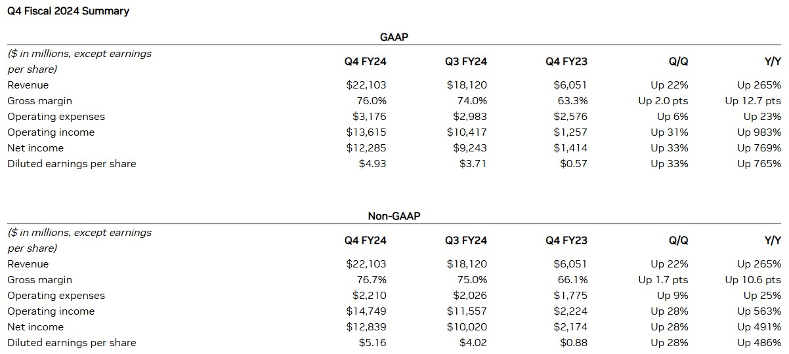
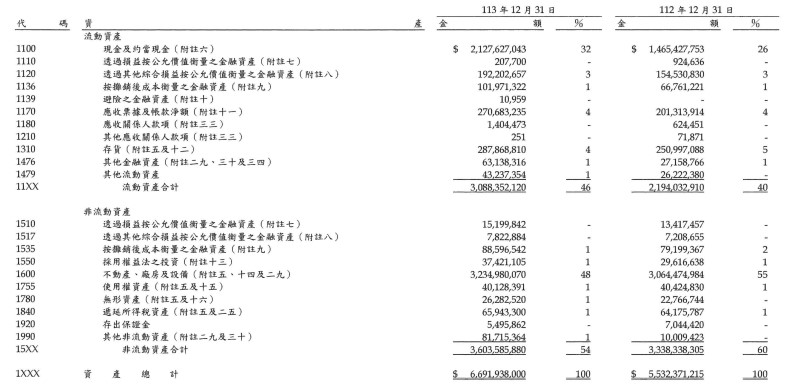

# VLM-related Issues

## LLaVA Experiment

### Task Target

1. 使用LLaVA v1.5針對各種圖表進行處理及分析，觀察LLaVA v1.5目前所遇到的問題
2. 透過Prompt設計或其他方法引導LLaVA模型辨識出影像中可能存在的命名實體
3. 透過獲取的實體關係結合知識圖譜以加強模型分析及回答問題之能力


## LLaVA Install

If you are not using Linux, do *NOT* proceed, see instructions for [macOS](https://github.com/haotian-liu/LLaVA/blob/main/docs/macOS.md) and [Windows](https://github.com/haotian-liu/LLaVA/blob/main/docs/Windows.md).

1. Clone this repository and navigate to LLaVA folder
```bash
git clone https://github.com/waynechang95/VLMEXP.git
cd VLMEXP/LLaVA
```

2. Install Package
```Shell
conda create -n llava python=3.10 -y
conda activate llava
pip install --upgrade pip  # enable PEP 660 support
pip install -e .
```

## Dataset

Image segment from real financial statement report including English version and Chinese version.

1. English Version ( Ex: Dataset/English/1.jpg )

    

2. Chinese Version ( Ex: Dataset/Chinese/1.jpg )

    


## Run 

Automatic script to collect the output from the model.

1. Setting Path and Prompt ( ex: RUN/test.py )

```Python
from llava.model.builder import load_pretrained_model
from llava.mm_utils import get_model_name_from_path
from llava.eval.run_llava_output import eval_model

import json
import os

model_path = "liuhaotian/llava-v1.5-7b"

# Prompt Design
prompt = "for the following graph, please show what is the graph about?"

# Setting File Path
image_file_path = 'Dataset/English'
image_file_list = os.listdir(image_file_path)

# Setting Output Path
output_path = 'Result/output.json'

output = []

for i in image_file_list:

    image_file = image_file_path + i

    args = type('Args', (), {
        "model_path": model_path,
        "model_base": None,
        "model_name": get_model_name_from_path(model_path),
        "query": prompt,
        "conv_mode": None,
        "image_file": image_file,
        "sep": ",",
        "temperature": 0,
        "top_p": None,
        "num_beams": 1,
        "max_new_tokens": 4096
    })()

    answer = {
        "Image": image_file,
        "Answer": eval_model(args)
    }

    output.append(answer)

with open(output_path, 'w', encoding='utf-8') as outfile:
    json.dump(output, outfile, ensure_ascii=False, indent=4)


```

## Result

1. Output Format

```JSON
{
        "Image": "file path",
        "Answer": "LLaVA output"
    }
```

2. Example (Chinese/1.jpg)


3. LLaVA V1.5 7B

```JSON
{
        "Image": "Chinese/Dataset/Chinese/1.jpg",
        "Answer": "The graph is a financial spreadsheet displaying various financial data, including numbers and calculations. It appears to be a table with columns and rows, possibly showing the balance of a company or an individual's financial situation. The numbers are presented in both English and Chinese, indicating that the data might be related to an international or multicultural context. The spreadsheet is filled with numbers and calculations, providing a detailed view of the financial information."
    }

```

4. LLaVA V1.6 7B
```JSON
{
        "Image": "Dataset/English/1.jpg",
        "Answer": "The graph you've provided appears to be a financial summary or a financial statement for a company, specifically for the fiscal year 2024. It includes various financial metrics such as revenue, gross margin, operating expenses, operating income, net income, diluted earnings per share, and non-GAAP financial measures.\n\nHere's a breakdown of the information presented:\n\n1. **Revenue**: The company's total revenue for the fiscal year 2024 is $22,103 million.\n\n2. **Gross Margin**: The gross margin is the percentage of revenue that is left after subtracting the cost of goods sold. It is 70.6% for the fiscal year 2024.\n\n3. **Operating Expenses**: The operating expenses are the costs incurred in the day-to-day operations of the business. They are $13,716 million.\n\n4. **Operating Income**: The operating income is the profit from the company's core business operations, excluding certain items. It is $14,749 million.\n\n5. **Net Income**: The net income is the company's profit after accounting for all expenses and taxes. It is $12,829 million.\n\n6. **Diluted Earnings per Share (EPS)**: This is the company's profit per share, adjusted for dilution. It is $5.16.\n\n7. **Non-GAAP Financial Measures**: These are financial measures that are not in accordance with Generally Accepted Accounting Principles (GAAP). They are often used to provide additional information about a company's financial performance.\n\n8. **Q4 FY24**: This refers to the fourth quarter of the fiscal year 2024.\n\n9. **Q3 FY24**: This refers to the third quarter of the fiscal year 2024.\n\n10. **Q2 FY24**: This refers to the second quarter of the fiscal year 2024.\n\n11. **Q1 FY24**: This refers to the first quarter of the fiscal year 2024.\n\n12. **YTD FY24**: This refers to the year-to-date fiscal year 2024, which includes the first four quarters.\n\n13. **YTD FY23**: This refers to the year-to-date fiscal year 2023, which includes the first four quarters.\n\n14. **YTD FY22**: This refers to the year-to-date fiscal year 2022, which includes the first four quarters.\n\n15. **YTD FY21**: This refers to the year-to-date fiscal year 2021, which includes the first four quarters.\n\nThe graph is a snapshot of the company's financial performance over the past four years, providing a comparison of the company's financial health and growth over time."
    }
```
